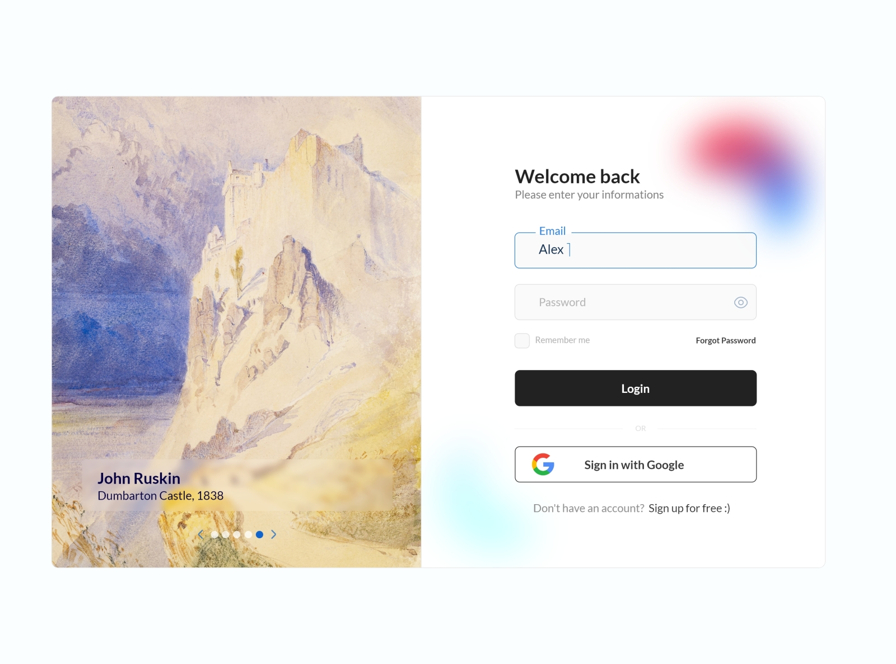

# LoginForm
Create a login form using only HTML and CSS in the Odin project

## 목표
- 1. HTML, CSS만 이용하여 레이아웃 구성
- 2. 완성된 디자인을 참고하여 비슷하게 구현하기

### 참고할 디자인

- 출처: [login and sign up form - Reza Taheri](https://dribbble.com/shots/17543942-login-and-sign-up-form)

